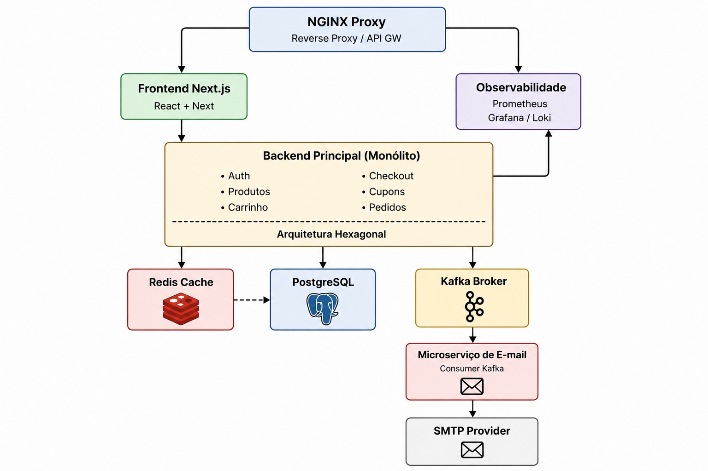

# LAPES - Sistema E-commerce Simplificado

## Projeto desenvolvido para o processo seletivo do LAPES 2026.

## Candidato

Felipe Gabriel Souza Liborio

## Contatos

* Email: felipesouzaliborio@gmail.com

* Celular: +55 (91) 98806-4813

## Trilha de Desenvolvimento

### Mini E-commerce

## Stack

### Frontend

- React
- Next.js
- TypeScript

### Backend

- Java
- Spring Framework
- JWT
- microserviço com comunicação assíncrona

### Banco de Dados

- PostgreSQL
- Redis

### Mensageria

- Apache Kafka

### Observabilidade

- Prometheus
- Grafana
- Loki

### Infraestrutura

- Docker
- proxy reverso (Nginx)

## Arquitetura

O sistema será baseado em uma arquitetura híbrida composta por:

* Um backend principal monolítico modular responsável pelas regras de negócio da aplicação
* Um microsserviço dedicado ao envio de e-mails
* Arquitetura Hexagonal no backend principal
* Comunicação assíncrona entre serviços utilizando Apache Kafka
* Arquitetura orientada a eventos
* Cache distribuído utilizando Redis
* Observabilidade com Prometheus, Grafana e Loki
* Infraestrutura containerizada com Docker
* Proxy reverso utilizando NGINX

## Fluxo Principal

